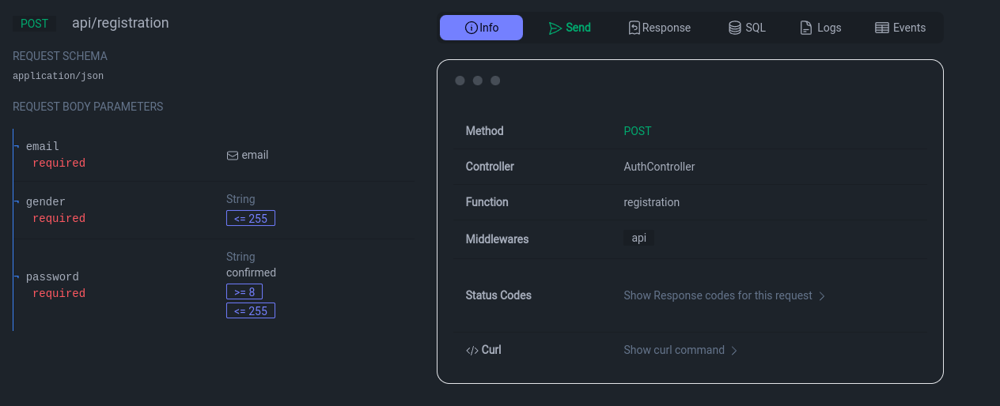
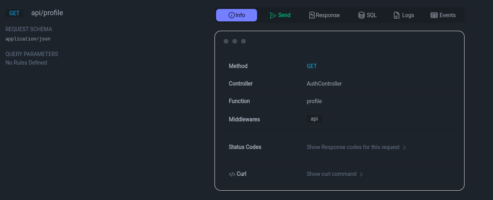
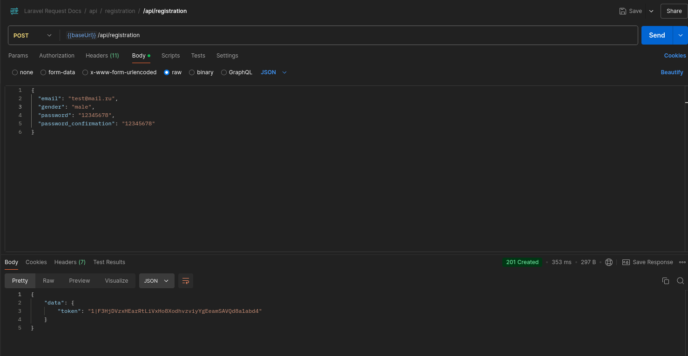
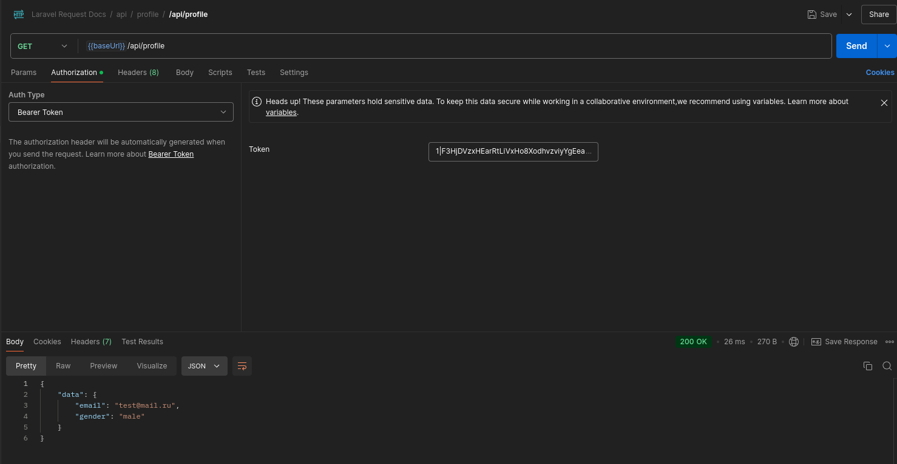

# Тестовое задание

## Маршруты

1. Регистрация пользователя

2. Вывод данных профиля

## Тестирование

Присутствуют интеграционные тесты по пути ``tests/Feautre/Http/Controllers/Api/AuthControllerTest.php``

Скриншоты из postman:

## Документация

Документация в формате openapi 3.0 хранится по пути ``docs/openapi.json``
